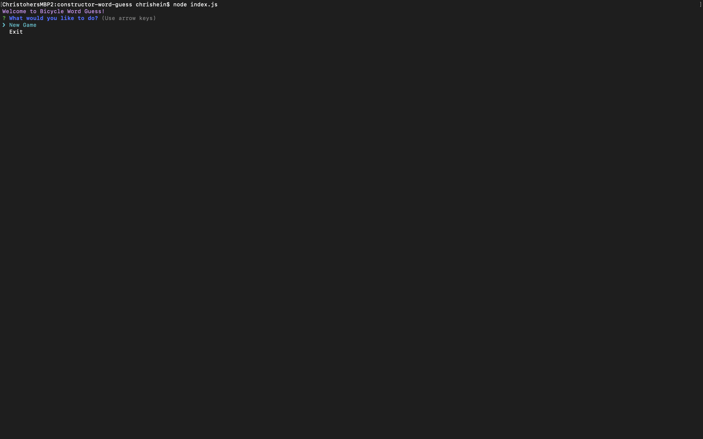
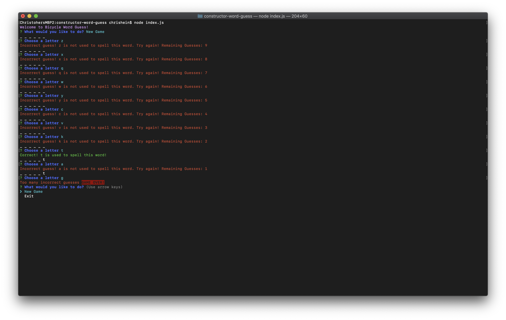

# Welcome to Constructor Word Guess
Constructor Word Guess is a colorful CLI-based, bicycle-themed word guessing game.  

#### Getting Started
To install on your local machine, run the following in your terminal:
```
$ npm install constructor-word-guess
```
Create a .js file and use the following
```
require('./node_modules/constructor-word-guess')
```

#### Game Play
Users will first be greeted with an option to play a new game or exit the game.


Upon selecting "New Game" users will start a new game and can begin guessing letters. 

Users may only enter one lowercase letter. If a user enters numbers, special characters, uppercase letters or multiple letters they will see an error message instructing them of their mistake. 


When a user guesses all the letters of a word correctly, they will be notified that they have one and will be asked if they want to start a new game or exit. 


Should a user make 10 mistakes when guessing letters, they will lose the game and be offered the opportunity to either start a new game or exit. 


Exiting the game will take the user back to the terminal.


### NPMs used
- [Inquirer](https://www.npmjs.com/package/inquirer)
- [Chalk](https://www.npmjs.com/package/chalk)